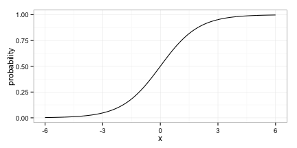
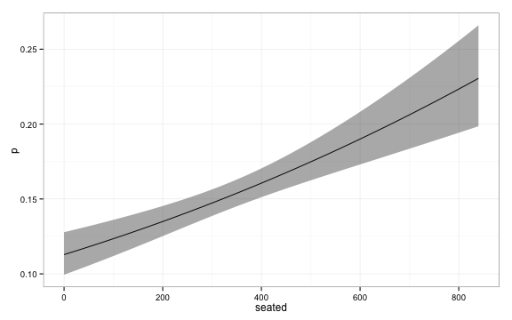
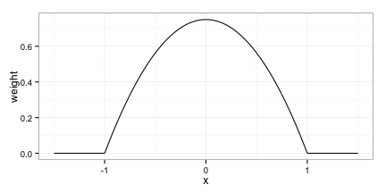
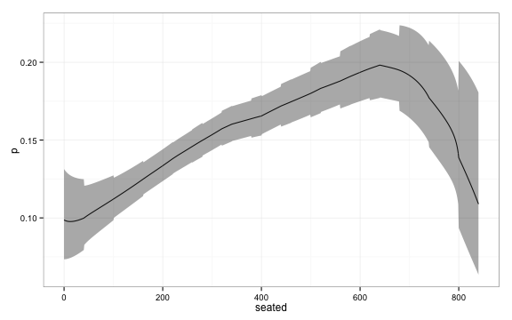
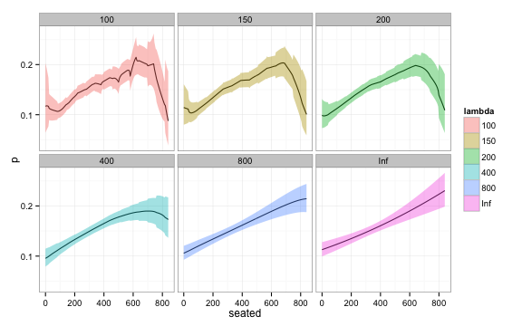

Given a male patient 45 years of age and a BMI of 27 how great is the risk of having diabetes? What is the relationship between the chance of wining an election and the campaign budget? How does the probability of playing in NBA increase with height?
A simple way to approach such problems is by looking at similar observations, for instance look at men at ages between 40-50 and a BMI 25-30 and use the frequency of diabetes in this group to infer the risk for our given patient. 
Logistic regression is a more sophisticated method. There we model the probability of having diabetes as a function of the covariates of the following form:

$$
\log\frac{\pi(\mathbf{x})}{1-\pi(\mathbf{x})} = \beta_0 + \sum_{i=1}^p \beta_ix_i.
$$

In the heart of this equation we have a linear model; even if the predicted probability is not linear in the predictors, it is restricted to the logistic curve:

 

No method is perfect: Logistic regression makes some crude assumptions on the data, this might be good in the face of few datapoints, but too restrictive if we have a lot of data. On the other hand nearest neighbor methods, does not make many assumptions and can capture non-linear relationships between predictor and response, but might fail if there are not enough similar patients or if we are at the boundary of the data. The last point is critical: Say that the risk of diabetes increases with BMI, and we have a patient with very high BMI, most similar patients will tend to have a lower BMI, and we will have a tendency to underestimate the diabetes-risk.

Locally weighted logistic regression tries to marry the two methods. The prediction in a point, $$x$$, is based on a logistic regression model, but with a weighted dataset, that emphasizes datapoints near $$x$$.

#### Fitting 

Locally weighted logistic regression models can be fitted using `glm` just as usual logistic regression. We need to set the weights using the `weight` argument in `glm`. The documentation states that:

<blockquote>
For a binomial GLM prior weights are used to give the number of trials when the response is the proportion of successes.
</blockquote>

The method does produce the correct estimates even if we provide non-integer weights, we will get a warning though and one should be cautious of scaling the weights correctly if you want confidence intervals(more below). To get rid of the of the warning use `family=quasibinomial('logit')` instead of `family=binomial('logit')`.

We look at a dataset from the _National Healthh and Nutrition Examination Survey_.
The data can be found [here](http://www.umass.edu/statdata/statdata/data/).
We will try to estimate risk of being `obese` using `seated` the number of minutes of seated activity pr. week.
Notice that `seated` is reported rather than measured thus taking only values that are multiples of 30 in the higher range.
This is less than ideal, but I went with this dataset anyway because it provides a good example of a non-monotone relation between predictor and response.

```r
library(dplyr)
nhanes <- read.table('nhanes.dat', na.strings=".")[,c(20,21)] %>%
  do(filter(.,complete.cases(.)))

names(nhanes) <- c('seated', 'obese')
```

First we fit a simple logistic regression model 


```r
lrfit <- glm(obese ~ seated, 
             data = nhanes, 
             family = binomial('logit'))

# Obtain estimates
newdata = data.frame( seated = seq(0,840,5))
pred <- predict(lrfit, newdata, type='link', se.fit = T)

# Calculate confidence intervals
upr <- lrfit$family$linkinv( pred$fit + (1.96 * pred$se.fit) )
lwr <- lrfit$family$linkinv( pred$fit - (1.96 * pred$se.fit) )
fit <- lrfit$family$linkinv( pred$fit )

plot_df <- data.frame( seated = seq(0,840,5),
                       p = fit, 
                       upr = upr, 
                       lwr = lwr,
                       lambda = Inf )
```

We get the following estimates of the probability. 

```r
library(ggplot2)
ggplot(plot_df, aes(x = seated, y = p, ymin = lwr, ymax = upr)) + geom_line() + geom_ribbon(alpha = 0.4) + theme_bw()
```

 

We now turn to local logistic regression. When we fit the local logistic regression model we have to decide a [kernel](http://en.wikipedia.org/wiki/Kernel_%28statistics%29), $$K$$, and a kernelwidth, $$\lambda$$. The weight we put on each datapoint when we estimate $$\pi(x)$$ is a function of the distance, $$d$$, from $$x$$ to the datapoint.

$$
w(d;\lambda) = K\left(\frac{d}{\lambda}\right)
$$

We will use the Epanechnikov kernel given by

$$
K(x) = \frac{3}{4}\left( 1-x^2 \right)\mathbb{1}(|x| < 1)
$$



Any kernel can be used, but it is advantagous to use a kernel, that dies off completely(i.e. puts weight 0 on some observation) as this reduces the computational cost of evaluating the model. 

And finally some action: We fit a local logistic regression model using $$\lambda = 200$$. We chose this value of $$\lambda$$ using 5 repeats of 10-fold cross validation and using AUC as selection criteria. This was aided by the `caret` package and the use of custom models. The code is ugly and reflects that I'm still a novice using `caret` so I will spare you.


```r
kernel_width <- 200
loclog <- sapply(seq(0,840,1), function(x){
  # Calculate weights and remove observations falling outside kernel
  dat <- nhanes %>% 
    filter( abs(seated - x) < kernel_width) %>%
    mutate( weight = pmax( 1 - ((seated-x)/kernel_width)**2,0) )
  
  # Fit model locally
  lrfit <- glm(obese ~ seated, 
               data = dat, 
               family = quasibinomial('logit'), 
               weights = dat$weight )
  
  # Predict locally
  newdata <- data.frame( seated = x)
  pred <- predict(lrfit, newdata, type='link', se.fit = T)
  
  upr <- pred$fit + (1.96 * pred$se.fit)
  lwr <- pred$fit - (1.96 * pred$se.fit)
  fit <- pred$fit
  
  lrfit$family$linkinv( c(lwr, fit, upr))
})

df <- data.frame(seated = seq(0,840,1), 
                      p = loclog[2,], 
                      lwr = loclog[1,], 
                      upr = loclog[3,], 
                      lambda = 10) 
```

```r
ggplot(df, aes(y = p, x = seated, ymin = lwr, ymax = upr)) + geom_line() +
  geom_ribbon(alpha = 0.4) + theme_bw()
```

 

#### Confidence intervals

You may skip the next part, as it is a bit technical. The take-home message is:
_In order to obtain correct confidence intervals(CIs), multiply you kernel by a constant such that $$K(0)=1$$_.

In _The Elements of Statistical Learning_ there is a point about getting confidence intervals(CI) for you estimates for "free".
However in order to obtain correct CI's you need to be careful with the weights you use.
For instance in logistic regression multiplying all weights by a constant factor $$c$$ will not influence your estimate, 
essentially you are just multiplying the log likelihood function by the same constant.
But the CI's gets more narrow the higher the weights, again this is because the observed Fisher information increases with the weights. 

So we have to find the correct scaling $$c_\lambda$$ for a given $$\lambda$$.
Our weights are

$$
w(x; \lambda) = K\left(\frac{x}{\lambda}\right)c_\lambda
$$

Two simple assumptions can help us find the correct weights.

1. Rescaling predictors _and_ $$\lambda$$ with a constant $$\alpha$$, should leave the weights unchanged
2. As the $$\lambda \rightarrow \infty$$ we approach regular logistic regression, and thus all weights should be 1. 

In mathematical terms.

$$
w(x; \lambda) = w(\alpha x; \alpha \lambda)
$$

and

$$
\lim_{\lambda \rightarrow \infty} w(x, \lambda) = 1
$$

From the first equation we easily get $$c_\lambda = c_{\alpha\lambda} =  c$$, that is the constant we have to multiply the weights by, does not change with $$\lambda$$. From the second equation we get

$$
\begin{aligned}
\lim_{\lambda \rightarrow \infty}K\left(\frac{x}{\lambda}\right)c = K(0)c = 1 \implies
c = \frac{1}{K(0)}.
\end{aligned}
$$

That is just multiply you kernel by a constant such the $$K(0) = 1$$.


Here is a plot of fit of confidence intervals for different values of $$\lambda$$. Notice how the width of the confidence interval approaches that of global logistic regression for large $$\lambda$$'s.


```r
plot_df$lambda <- as.factor(plot_df$lambda)
ggplot(plot_df, aes(y = p, x = seated, fill = lambda, ymin = lwr, ymax = upr)) + geom_line() +
  geom_ribbon(alpha = 0.4) +
  facet_wrap(~ lambda) + theme_bw()
```

 

#### End notes
Even if local logistic regression is not an optimal choice for a predictive model in your setting, it is still a useful tool to visualize the relationship between a predictor and a binary outcome. 
Logistic regression provides a method to control the bias, that nearest neighbor methods may exhibit near the boundaries.
For a more lengthy discussion see chapter 6 in [_The Elements of Statistical Learning_](http://statweb.stanford.edu/~tibs/ElemStatLearn/).