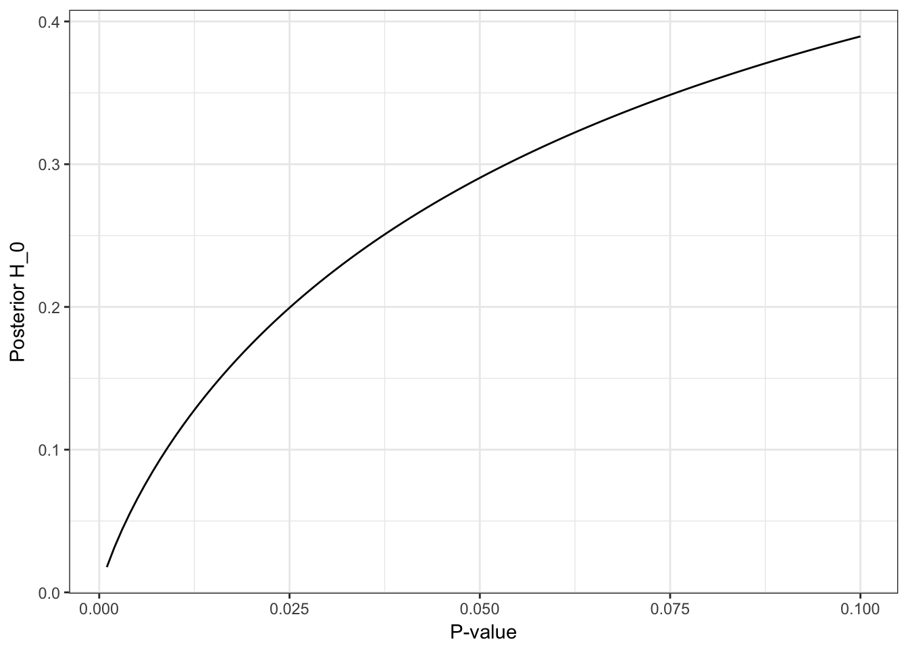

You might want to argue that the question in the subtitle is based on a false premise; 
the p-value is related to the probability of falsely rejecting the null hypothesis conditional on the level ($$\alpha$$) and the null hypothesis being true.
The question of whether the null-model valid or not is only assessed from this viewpoint and we certainly cannot assign a probability it. 

However in Bayesian statistics such a question is perfectly valid.
The theory of Bayesian robustness examines how sensitive a Bayesian inference is to the choice of prior.
Thereby addressing one of the main criticisms of Bayesian statistics.
In a seminal [paper](http://www.jstor.org/stable/2289131), James O. Berger and Thomas Sellke consider a single realization (the results still holds for multiple realizations) of a normal variable with known variance:
$$
X \sim \mathcal{N}(\theta, 1)
$$
and a test for the hypothesis
$$
M_0: \theta = 0
$$
against the alternative
$$
M_1: \theta \neq 0.
$$
Let's also phrase a Bayesian model; we give each of the two models an equal prior probability
$$P(M_0)=\frac{1}{2}.$$ 
We also need a prior for $$\theta$$ under $$M_1$$, $$g(\theta)$$. Berger and Sellke shows that if $$|X| > 1$$ corresponding to a p-value less than 0.32, the prior favoring $$M_1$$ the most within the class of symmetric unimodal distributions is a uniform distribution,

$$
g(\theta) = \frac{1}{2K},\,\,\, \theta \in [-K, K]
$$

We find the $$K$$ that maximizes the posterior probability of the alternative for different values of $$X$$ and their corresponding posterior probabilities and p-values. 

<table class="table" style="margin-left: auto; margin-right: auto; align: center; width: 60%; font-size: 1.3rem">
 <thead>
  <tr>
   <th style="text-align:left;"> P-value</th>
   <th style="text-align:right;"> Posterior of H0 </th>
  </tr>
 </thead>
<tbody>
  <tr>
   <td style="text-align:left;"> 0.100</td>
   <td style="text-align:right;"> 0.3895459 </td>
  </tr>
  <tr>
   <td style="text-align:left;"> 0.050 </td>
   <td style="text-align:right;"> 0.2904357 </td>
  </tr>
  <tr>
   <td style="text-align:left;"> 0.010 </td>
   <td style="text-align:right;"> 0.1094489 </td>
  </tr>
  <tr>
   <td style="text-align:left;"> 0.001 </td>
   <td style="text-align:right;"> 0.0177166 </td>
  </tr>
</tbody>
</table>

This answers our question: With the prior that _favors the alternative the most_ the posterior probability that the null hypothesis is true for a p-value of 0.045 is still 0.28. Not exactly overwhelming evidence for the alternative.

Below we have plotted the posterior probability for $$H_0$$ against the p-value for the prior that favors the alternative the most.

